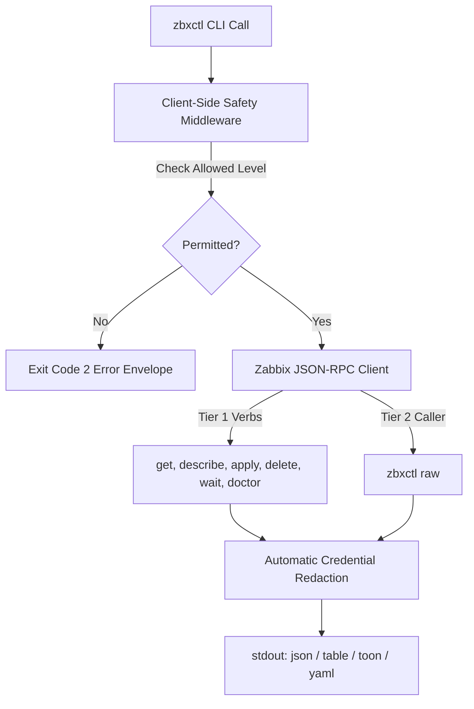

# Architecture & Design Philosophy

`zbxctl` is engineered around three core principles:
1. **Tiered Command Architecture** for 100% Zabbix 7 coverage without API bloat.
2. **Client-Side Safety Middleware** executing before network requests hit Zabbix.
3. **Token Efficiency** for AI agent context windows.

---

## Tiered Engine Breakdown



### Tier 1: Ergonomic Command Verbs
Tier 1 verbs provide standard Unix/cloud CLI operations:
- `zbxctl get <resource>`: Query hosts, problems, triggers, items, templates, dashboards, and metrics (`history`/`metric`).
 - `zbxctl get metric <item_id> --since=4h`: Fetch historical telemetry samples over a duration window.
 - `zbxctl get item --host=<name|id> --fields=itemid,name,description`: Filter items by target host and select specific output fields.
- `zbxctl describe <resource> <id>`: Fetch detailed, formatted resource metadata.
- `zbxctl apply -f manifest.yaml`: Declaratively create or update Zabbix resources.
- `zbxctl diff -f manifest.yaml`: Live dry-run diff against target instance state.
- `zbxctl wait <resource> <id>`: Synchronously poll until a target condition (e.g. problem resolution) is met.
- `zbxctl doctor`: Run real-time diagnostic checks on connectivity, credentials, and context safety.
- `zbxctl login <url> --context=<name>`: Authenticate and automatically activate the specified context.

### Tier 2: Universal Raw Engine (`zbxctl raw`)
When Zabbix introduces new API methods or specialized params, `zbxctl raw` allows direct invocation of **100% of Zabbix 7 JSON-RPC methods** while preserving client-side safety guardrails:

```bash
zbxctl raw proxygroup.get --params='{"output": "extend"}'
```

---

## Credential Redaction Architecture

All display commands pass output buffers through automatic secret sanitization. Sensitive key names (e.g. `api_token`, `password`, `http_password`, `X-Remote-User`) are rewritten to `[REDACTED]` before writing to terminal screens, logs, or pipeline outputs.

---

## Resource Aliases & Mental Model Ergonomics

To support different operational backgrounds without code duplication, `zbxctl` defines zero-overhead resource aliases. For example, historical numerical time-series samples can be queried interchangeably using any of the following terms:

- **`metric` / `metrics`**: Familiar to Prometheus, Grafana, and Datadog users (`zbxctl get metric 23253 --since=4h`).
- **`telemetry`**: Familiar to OpenTelemetry and APM engineers (`zbxctl get telemetry 23253 --since=4h`).
- **`history`**: Native Zabbix RPC terminology (`zbxctl get history 23253 --since=4h`).
- **`inventory` / `inv` / `host-inventory`**: Asset and hardware CMDB records decoupled from operational host monitoring.

All aliases map to the appropriate underlying RPC execution engine in `pkg/zabbix/mapping.go`.

---

## Architectural Decision Records (ADR)

### ADR-001: Decoupling Host Monitoring from Asset / CMDB Inventory

- **Status**: Accepted
- **Date**: 2026-08-16
- **Context**:
  In Zabbix 7, host asset inventory (OS version, vendor, hardware model, serial number, MAC address, contact details, chassis, location) is stored under the `host.*` JSON-RPC methods as a nested `inventory` dictionary.
  In previous iterations, querying or modifying inventory required either treating the entire host as a monolithic object or resorting to raw JSON-RPC calls (`zbxctl raw host.get` / `zbxctl raw host.update`). Furthermore, the word `inventory` was overloaded as a cluster sizing alias (`zbxctl cluster-info`).
- **Decision**:
  Adopt the **`kubectl` architectural pattern** of decoupling operational resource state from asset/CMDB metadata:
  1. **First-Class Logical Resource**: Expose `inventory` (aliases: `inv`, `host-inventory`, `inventories`) as an independent resource in `pkg/zabbix/mapping.go`.
  2. **Dedicated Table Schema & Field Projection**: `zbxctl get inventory` defaults to asset-focused columns (`HOSTID`, `HOST`, `NAME`, `MODE`, `TYPE`, `VENDOR`, `MODEL`, `MAC`, `OS`), automatically flattening nested inventory attributes for column selection and search.
  3. **Composite Host Inspection**: `zbxctl describe host <id>` retrieves `selectInventory: "extend"` alongside interfaces, tags, and groups, preserving comprehensive host inspection.
  4. **Declarative GitOps Manifests**: Enable `kind: inventory` in `zbxctl apply -f <manifest>` (and standard input streaming via `-f -`), allowing asset tracking automation to update inventory without modifying monitoring interfaces or template links.
  5. **Domain Disambiguation**: Remove `inventory` alias from `zbxctl cluster-info` so `inventory` strictly refers to hardware and asset records.
- **Consequences**:
  - Clean separation between monitoring engineers managing telemetry/triggers and CMDB/asset teams managing hardware metadata.
  - Eliminates the need for AI agents to fall back to `zbxctl raw host.get` or `zbxctl raw host.update` for inventory workflows.
  - Full compatibility with standard UNIX pipeline workflows (`cat inv.yaml | zbxctl apply -f -`).
